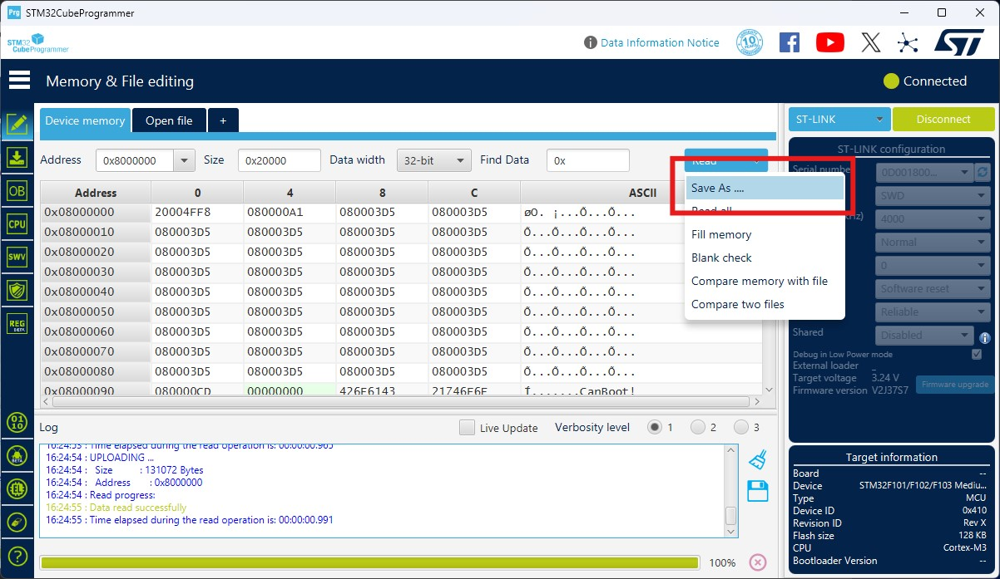
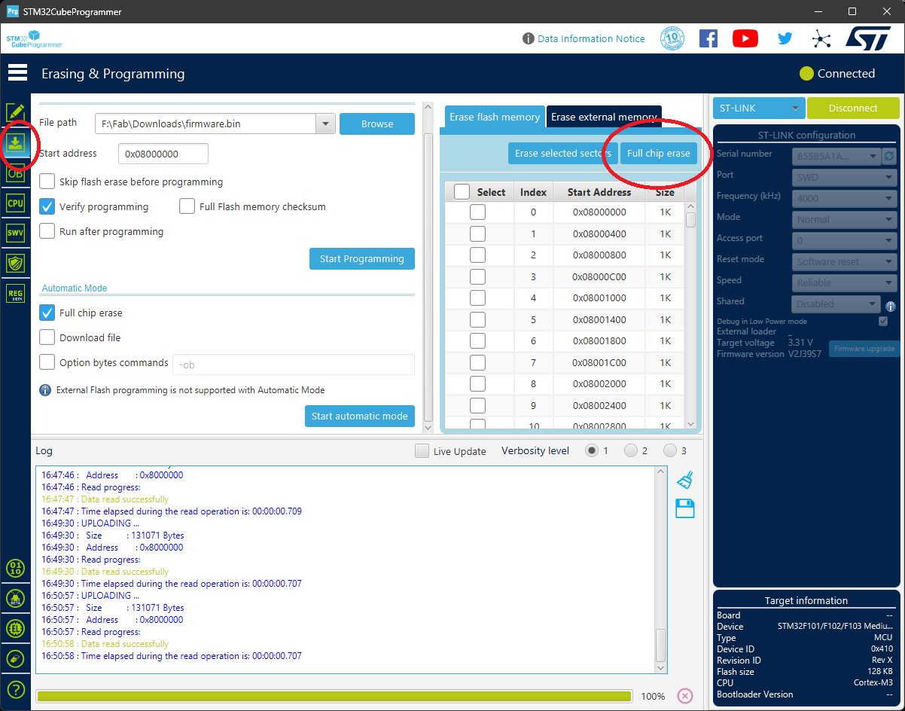
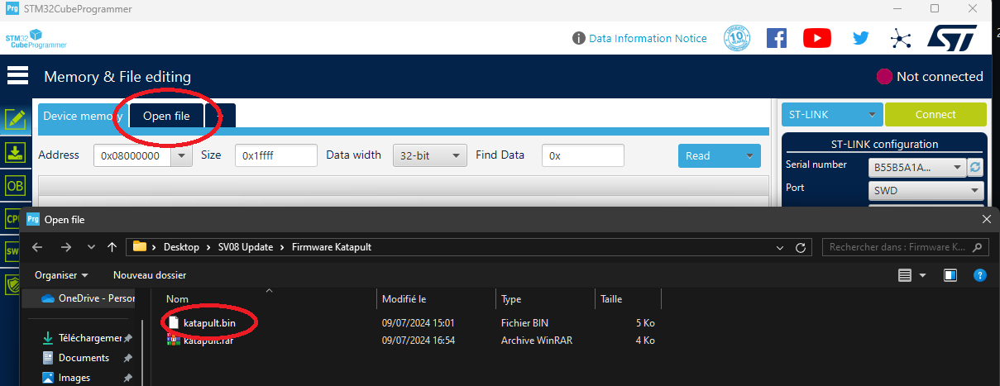
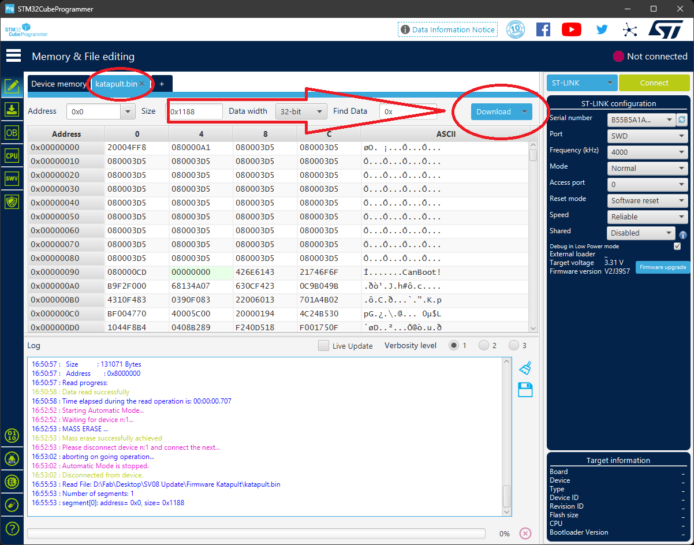

# Sovol-SV08-Mainline
Getting the Sovol SV08 onto mainline Klipper

This HOWTO will describe how to install mainline/regular klipper (via KIAUH) on your Sovol SV08 with the BTT CB1 image.<br>
<sub>Run it from either eMMC or SD card, you choose..</sub>


**TL;DR**: _make backup of klipper config, remove eMMC from printer, write CB1 image to eMMC, change BoardEnv.txt and system.cfg, put eMMC back in printer, install KIAUH; klipper, moonraker and mainsail (and optional extras), create firmware(s), flash toolhead and board MCU. DONE!_


## WORK IN PROGRESS
This is a work in progress, still some work needs to be done. You are the guinea pig ;)
Found something that doesn't work (properly), please share and contribute!


# INDEX
- [PREREQUISITES](#prerequisites)
- [STEP 1 - REMOVING THE EMMC FROM THE PRINTER](#step-1---removing-the-emmc-from-the-printer)
- [STEP 2 - WRITE eMMC OS IMAGE](#step-2---write-emmc-os-image)
    - [METHOD 1: WRITE IMAGE DIRECTLY TO eMMC](#method-1-write-image-directly-to-emmc)
    - [METHOD 2: WRITE IMAGE TO SD -> eMMC](#method-2-write-image-to-sd---emmc)
- [STEP 3 - CHANGES TO THE BOARDENV.TXT & SETUP WI-FI](#step-3---changes-to-the-boardenvtxt--setup-wi-fi)
- [STEP 4 - INSTALL MAINLINE KLIPPER](#step-4---install-mainline-klipper)
- [STEP 5 - CONFIGURE PRINTER/KLIPPER & ADDONS](#step-5---configure-printerklipper--addons)
- [STEP 6 - STOCK FIRMWARE BACKUP](#step-6---stock-firmware-backup)
- [STEP 7 - FLASH KATAPULT BOOTLOADER](#step-7---flash-katapult-bootloader)
- [STEP 8 - FLASH KLIPPER](#step-8---flash-klipper)
- [BIG THANKS & CONTRIBUTE](#big-thanks--contribute)
- [DISCLAIMER](#disclaimer)


# PREREQUISITES
- First create a **backup** of all the config files on your original Sovol SV08. You can do this in the web/mainsail interface -> Machine -> Select all files/folders -> Download
    - Optionally you can also SSH or FTP into your machine (ftp port: 22, username/password: sovol/sovol) and backup additional .sh scripts in the /home/sovol/ folder.
- You WILL need the printer.cfg later in this process (for the /dev/serial/by-id/usb-Klipper_stm32f103xe_ serials).
- You need a '**Makerbase MKS EMMC-ADAPTER V2 USB 3.0**' USB adapter to be able to read/write the eMMC.
    - It is recommended to get yourself a separate **eMMC module** (MKS eMMC Module) on which you install the new OS Image and mainline klipper. This way you always have a backup (eMMC) of a working printer.
        - 8GB eMMC have been reported not to work properly. Please get yourself a 32GB MKS eMMC to avoid issues.
- If you go for the '*method 2*' you need a big enough **SD card** (it's also possible to run everything from the SD card by the way).
- You will need an ST-Link V2 (Mini) with the **STM32CubeProgrammer** software installed to be able to update/flash the MCU firmwares.
- You can reach the sFTP server on IP of the printer, port 22

<br>

# STEP 1 - REMOVING THE eMMC FROM THE PRINTER
1. Obviously power off and disconnect the printer from mains.
2. Put the printer on it's back, so you have access to the underside of the printer.
3. Remove the metal plate by removing the 6 screws.
4. You can now see the eMMC module on the board, remove the 2 screws that are holding it in and carefully remove the eMMC module.
   - Take note of the direction of the eMMC module (*hint; you can also see an arrow on the board which way the module goes*)

<br>

# STEP 2 - WRITE eMMC OS IMAGE
Ok, first we need to set up our new eMMC module with the correct OS/Linux build. And for this we are going to use the bigtreetech CB1 Linux image (the original Sovol SV08 image was also based on this).

Here we can use 2 methods: 

**Method 1**; write the CB1 image directly to the eMMC and use it that way

**Method 2**; write the CB1 image to an SD card and use that to get the CB1 image on the eMMC.

***Method 3**: choose to run everything from the SD card and stop at Method 2.2*

> *Reason: it appears some people have boot issues when writing the CB1 image directly to the eMMC (board/eMMC does boot), the second method has been proven to be more successful in getting a booting eMMC. So method 1 does not work for you? Give method 2 a try, or start with method 2 directly.*

<br>

## METHOD 1: WRITE IMAGE DIRECTLY TO eMMC
1. Download the **MINIMAL** bigtreetech image. Careful, there's also a full image wich has an unknown version of klipper already installed. Go to: https://github.com/bigtreetech/CB1/releases
    - Used in this example 'CB1_Debian11_minimal_kernel5.16_20240319.img.xz': https://github.com/bigtreetech/CB1/releases/download/V2.3.4/CB1_Debian11_minimal_kernel5.16_20240319.img.xz
2. Put the eMMC module in the USB adapter (again, mind the direction of the module, there is an arrow on the adapter) and put the USB adapter in your computer.
3. Use BalenaEtcher (https://github.com/balena-io/etcher/releases) to write the image to the eMMC
    - Used in this example: balenaEtcher-win32-x64-1.19.21.zip (portable, so doesn't need an installer)
    - Open Balena Etcher<br>
        -> choose Flash from file, browse and choose the downloaded CB1 image<br> 
        -> Select the eMMC drive (e.g. Generic USB STORAGE DEVICE USB device)<br>
        -> Flash! (this will erase everything on the eMMC!)
4. After the flash is complete you can close BalenaEtcher. If everything is alright you now see a FAT drive called 'BOOT' (if not, eject the USB adapter and put it back in)

*You can now continue to **STEP 3***

<br>

## METHOD 2: WRITE IMAGE TO SD -> eMMC
1. First get yourself de latest image from : https://github.com/bigtreetech/CB1/releases
    - Used in this example 'CB1_Debian11_minimal_kernel5.16_20240319.img.xz': https://github.com/bigtreetech/CB1/releases/download/V2.3.4/CB1_Debian11_minimal_kernel5.16_20240319.img.xz<br>

2. Use BalenaEtcher (https://github.com/balena-io/etcher/releases) to write the image to the **SD card**
    - Used in this example : balenaEtcher-win32-x64-1.19.21.zip (portable, so doesn't need an installer)
    - Open Balena Etcher<br>
     -> choose Flash from file, browse and choose the downloaded CB1 image<br>
     -> Select the **SD card** <br>
     -> Flash! (this will erase everything on the SD card!)<br>

*Sidenote here : you could, if you choose here, run the printer from the SD card and skip the whole eMMC. Just so you know ;-)*

3. Put the eMMC module in the USB adapter (again, mind the direction of the module, there is an arrow on the adapter) and put the USB adapter in your computer.<br>

4. We need to clear all the partitions from the eMMC (this will erase everything on the eMMC!) :
    - In Windows open the command prompt (Win-R -> cmd) and run `diskpart` (be careful with diskpart, we don't want to erase the wrong disk here!)
    - In diskpart do `list disk` and see what disk is your eMMC
    - In diskpart run `select disk <nr>` where <nr> is the number of your eMMC. Please make sure this is the correct disk before you continue!
    - In diskpart run `clean` and it will erase everything/all partitions from the eMMC disk.
    - In diskpart run `exit` to exit

    

*You can now continue to **STEP 3** and then come back here!*

5. If everything is ok you should have booted from the SD card, and it's time to copy all the contents to the eMMC and make it bootable.
    - First check if the eMMC is recognized and available:
        - Run the command `fdisk -l` and you should see some storage devices including the eMMC (*e.g. /dev/mmcblk1 for the SD card and /dev/mmcblk2 your eMMC*)
    - Run the command `sudo nand-sata-install`
        - Choose the option 'Boot from eMMC - system on eMMC'
    - It will now create and format a partition (ext4) on the eMMC, and it will copy all it's contents from the SD card to the eMMC
    - When it's done power off the SV08, remove the SD card and boot from the eMMC. If everything has gone correctly you should now boot from the eMMC and can continue with **STEP 4**.

<br>

# STEP 3 - CHANGES TO THE BOARDENV.TXT & SETUP WI-FI
To make the CB1 image setup correctly we need to make a few changes to the BoardEnv.txt. Also, we need to set up Wi-Fi credentials (if not connected via ethernet) in the system.cfg

1. Go to the 'BOOT' drive and make a **BACKUP** of 'BoardEnv.txt' on your harddisk.
2. Open 'BoardEnv.txt' in your favourite text editor.
3. You need the following settings, and only those settings (taken from the Sovol image, please change/add/adapt where necessary):
    ```
    bootlogo=false
    overlay_prefix=sun50i-h616
    fdtfile=sun50i-h616-biqu-emmc
    console=display
    overlays=uart3
    overlays=ws2812
    overlays=spidev1_1
    #------------------------------------------------#
    rootdev=UUID=795...WHATEVER-WAS-THE-ORIGINAL-VALUE-SEE-NOTE-1...274
    rootfstype=ext4
    ```
    > <sub>**NOTE 1**: just keep the rootdev and rootfstype under the #----# line as they are in your BoardEnv.txt, don't copy the above if not the same</sub><br>
    > <sub>**NOTE 2**: `fdtfile=sun50i-h616-biqu-emmc` is needed so your eMMC is supported and available</sub><br>
    > <sub>**NOTE 3**: you want to run everything from the SD card, then you can keep it like this: `fdtfile=sun50i-h616-biqu-sd`</sub><br>
    > <sub>**NOTE 4**: by setting bootlogo=false you get the linux boot messages on the HDMI display, if you set bootlogo=true you only see them when connecting a keyboard and pressing a key.</sub><br>
    - Save your changed BoardEnv.txt!

4. Change the Wi-Fi credentials in the 'system.cfg'
    - optional: uncomment the hostname and set the hostname to e.g. "SV08"
    - Save changes to the system.cfg

5. Eject the USB adapter from your computer and put that eMMC (and **SD card** in case of *method 2*) back into the printer and boot that thing!
    - SSH into the printer (find ip on your router or use the configured hostname), username/password: biqu/biqu
    - If everything is ok your printer will boot nicely, you can SSH into the printer, and you are done with this step and ready to install mainline klipper. You can also continue ***method 2**, point 6, and finalize writing the system to eMMC*!

<br>

# STEP 4 - INSTALL MAINLINE KLIPPER
Time for the fun stuff! Now we shall install KIAUH, Klipper, Moonraker etc.
Please SSH into your printer and then do the following steps.

1. First we will update the OS:<br>
    - `sudo apt update && sudo apt upgrade`

2. Then install git (might already be installed) and KIAUH with the following commands:
    - `sudo apt-get update && sudo apt-get install git -y`
    - `cd ~ && git clone https://github.com/dw-0/kiauh.git`

3. Start KIAUH with the following command :
    - `./kiauh/kiauh.sh`

4. Install Klipper, Moonraker, Mainsail and Crowsnest (in this order) via KIAUH.
    - So run KIAUH and choose : option **'1) [Install]'** and install those items (*using default options, download recommended macro's; Yes*).
    - Crowsnest install asks to reboot printer, please do so.

5. Install Numpy (needed for input shaping)
    ```python
    sudo apt update
    sudo apt install python3-numpy python3-matplotlib libatlas-base-dev libopenblas-dev
    ~/klippy-env/bin/pip install -v numpy
    ```

6. You have now installed mainline klipper with the mainsail web-interface!
    - If not rebooted after Crowsnest install :<br> `sudo reboot`
    - After the board has rebooted, in your browser go to mainsail web-interface (via the ip-address or hostname) and check if it's running.
    - Obviously it will give an error since we still have to put our backed up printer.cfg back.

<br>

# STEP 5 - CONFIGURE PRINTER/KLIPPER & ADDONS
Next we have to configure our printer and put back some addons Sovol has added (probe_pressure and z_offset_calibration) and get the basics working.

1. RESTORE THE SOVOL ADDONS *(from the `/sovol-addons/` directory)* :<br>
        - use an FTP program to connect to the printer (ip-address or hostname, ftp port: 22, username/password: biqu/biqu)<br>
        - put the files 'probe_pressure.py' and 'z_offset_calibration.py' into the '/klipper/klippy/extras/' folder.<br>

2. CONFIGURE PRINTER *(from the `/config/` directory)* :<br>
    - copy :<br>
            `printer.cfg`<br> 
            `sovol-macros.cfg`<br>
            `sovol-menu.cfg`<br>
            `saved_variables.cfg`<br>
            `crowsnest.conf`<br> 

        to the `~/printer_data/config` folder.<br>

    - **IMPORTANT** : open your backed up printer.cfg and copy the correct serials under [mcu] and [mcu extra_mcu] (/dev/serial/by-id/usb-Klipper_stm32f103xe_) to your new printer.cfg<br>

3. Do a firmware_restart (or reboot the whole printer) and you should have a working SV08.

4. Update the slicer start g-code. The START_PRINT macro has been updated/improved: uses your actual bed temperature for meshing etc., does a QGL with home Z, does a Z_OFFSET_CALIBRATION before each print.
    - Go to OrcaSlicer and edit the printer settings :<br>
        -> Machine<br>
        -> G-code<br>
        -> change your 'START_PRINT' line to this:<br>
         `START_PRINT EXTRUDER_TEMP=[nozzle_temperature_initial_layer] BED_TEMP=[bed_temperature_initial_layer_single]`<br>

    - Now you can print and use the sovol presets like before!

> <sub>**NOTE 1**: all the .sh scripts in the macro's and have been commented out and there is a basic but reduced version of the sovol menu. It has all the basics to get you going.</sub><br>
> <sub>**NOTE 2**: the [adxl345] and [resonance_tester] configs have been commented out at this point, the toolhead mcu needs a new firmware for this, do the next steps and you can use it again.</sub>

<br>

# STEP 6 - STOCK FIRMWARE BACKUP
It's important to make a backup of the current (stock) firmware. This way you can always revert back to this stock configuration. These steps are applicable to both the toolhead and mainboard MCU.

1. First make sure you have a properly installed ST Link with the STM32CubeProgrammer software.
    - Download the STM32CubeProgrammer software here: https://www.st.com/en/development-tools/stm32cubeprog.html#st-get-software
    - Install the software and make sure the ST Link is also properly installed; the software should show a serial of your ST Link just below the CONNECT button (if not you can click on the little refresh button)

2. Turn the printer OFF and remove the ST Link from your computer, next connect the ST Link to your board (either toolhead or mainboard).
    - MAKE SURE YOU WIRE THIS CORRECTLY, the pinout on the boards is; 3.3v - IO - CLK - GND
    - Refer to your ST Link (manual) for the pinout on the adapter!
    
    ### Toolhead wiring example:
   <p></p>

    ### Motherboard wiring example:
    <p></p><br>

4. Insert the ST Link into your computer, open the STM32CubeProgrammer software and press CONNECT. It should now connect an populate the middle screen with memory stuff.
5. Please select `Read all` from the `Read` menu, this will read everything and set the correct size (to save).

    

6. Please select `Save As ..` from the `Read` menu and save the current firmware (e.g. *toolhead_original_firmware.bin* or *mainboard_original_firmware.bin*).

    

7. Make sure the firmware backup file is 128k. If it is 1 Kilobyte it is too small, and you won't be able to return to the old firmware.

8. In case that already happened here is a <a href="firmware-backups/toolhead-0x80000000-sv08-20040628.bin">firmware backup</a> of a SV08 toolhead, printer delivered to EU on 2024-06-28.

<br>

# STEP 7 - FLASH KATAPULT BOOTLOADER
To make life more easy in the future we are going to flash Katapult to our MCU's. This is a bootloader which makes it possible to flash Klipper firmware without the ST Link via regular SSH.
1. Switch the printer on, SSH into the printer and install Katapult :
    - Run the command <br>
    `cd ~ && git clone https://github.com/Arksine/katapult` <br>
    to install Katapult<br>

    - Install pyserial with *(we need this later to flash the firmware)*<br>
    `pip3 install pyserial` <br>
    
2. When it's done, do <br>
`cd ~/katapult`<br> 
`make menuconfig`<br><br>
 And in menuconfig select the following options :<br>
    
3. Press Q to quit and save changes.
4. Run the command to build the firmware (*katapult.bin*)<br>
`make clean`<br>
`make`<br>

5. Please use e.g. an FTP program to grab this file `~/katapult/out/katapult.bin` and store it on the computer. You can use this Katapult firmware for both the toolhead and the mainboard.
6. Turn OFF the printer again and after it's off insert the ST Link again into the computer and start the STM32CubeProgrammer software and CONNECT.
7. Once connected on the left side in the software go to the tab 'Erasing & Programming' and execute a `Full chip erase`

    

8. Time to flash! Go back to the 'Memory & File editing' tab and select 'Open file' and browse/select/open the `katapult-toolhead.bin` or `katapult-mainboard.bin`, next press the 'Download' button to write the firmware.

    <br>

    <br>

Done! The Katapult bootloader is on the MCU! Please click on 'Disconnect' and then remove the ST Link from the computer and the board. Do this for both the toolhead and the mainboard MCU.

<br>

# STEP 8 - FLASH KLIPPER 
> [!NOTE]
> The standard Klipper firmware works on both the toolhead MCU and the mainboard MCU. Originally Sovol made multiple changes to the `stm32f1.c` source for the firmware but they are not mandatory. Only now the printer starts up silently; no fans, no light and no display during boot. You CAN get some of this functionality back by enabling GPIO pins during startup, see notes below make menuconfig.

It's time to create and flash the Klipper firmware! In the future you only have to do this step when you need to update your Klipper firmware. *This section assumes you already have **Katapult** flashed and **pyserial** (step 7.1) installed.*
1. Switch on the printer and SSH into the printer.
2. We are now going to create the klipper firmware, do<br>
`cd ~/klipper`<br>
`make menuconfig`<br>
and select the following options:<br>


> <sub>**NOTE 1**: because we are using Katapult as bootloader, make sure you set the 8 KiB bootloader offset.</sub><br>
> <sub>**NOTE 2**: want the *mcu fan and light* enabled during boot? Add `PA1,PA3` to the 'GPIO pins to set at micro-controller startup' when making the ***mainboard MCU*** firmware.</sub><br>
> <sub>**NOTE 3**: want the *hotend fan* enabled during boot? Add `PA6` to the 'GPIO pins to set at micro-controller startup' when making the ***toolhead MCU*** firmware.</sub><br>
> <sub>*(Warning: doing note 2 & 3 means you need to compile a seperate firmware for each MCU, with the correct GPIO pins, every time you want to flash klipper!)*</sub>

3. Press Q to quit and save changes.<br>

4. Run the command to create the Klipper firmware (`klipper.bin`)<br>
`make clean`<br>
`make` <br>

5. Since we flashed Katapult earlier we should now be able to flash the Klipper firmware to our MCU from SSH (without the ST Link):
    - Find the correct serial name for the MCU with the command<br>
    `ls /dev/serial/by-id/*`<br>
    copy the last part where the * is in the command for the next step.<br><br>
    
    > Tip: Don't know what serial to use? Check your printer.cfg backup; [mcu] for the mainboard MCU, [mcu extra_mcu] for the toolhead MCU. Does the printer.cfg only show `/dev/ttyACM*` then use this command to find out `ls -la /dev/serial/by-id/`

    - Put the Katapult bootloader in DFU mode with this command `cd ~/klipper/scripts/ && python3 -c 'import flash_usb as u; u.enter_bootloader("/dev/serial/by-id/xxxxx")'` (replace xxxxx with the serial you just copied)
    - Now Katapult is in DFU mode, again look for the correct serial with<br>
    `ls /dev/serial/by-id/*`<br>

    <br>

    and you should see one that starts with `usb-katapult_` and use that one (if you haven't flashed Klipper yet after Katapult you probably already had one started with `usb-katapult_` :thumbsup:).

    - Stop the klipper service with `sudo service klipper stop`
    - Execute the flash with the following command `cd ~/katapult/scripts && python3 flashtool.py -d /dev/serial/by-id/xxxxx` (again replace xxxxx with the correct serial)
        - This will take the default klipper.bin from the `/klipper/out` folder and flash it.
    - Start the klipper service with `sudo service klipper start`

7. Do a firmware restart and you are ready. In case you flashed the toolhead MCU you can now uncomment the [adxl345] and [resonance_tester] parts in your printer.cfg

Done! The Klipper firmware on the MCU has been updated. Do this for both the toolhead and the mainboard MCU.

<br>

# BIG THANKS & CONTRIBUTE
Big thanks to all the people on the Sovol discords (both official and unofficial) who have helped or participated in this project in any way.
Special thanks go out to: ss1gohan13, michrech, Zappes, cluless, Haagel, Froh  - *you guys rock!*

You feel like contributing to this project/guide? That would be awesome! Please make a pull request or issue and then it can be added to the guide!

<br>

# Disclaimer
This guide and all changes have been made with the best intentions but in the end it's your responsibility and *only your responsibility* to apply those changes and modifications to your printer. Neither the author, contributors nor Sovol is responsible if things go bad, break, catch fire or start WW3. You do this on your own risk!
